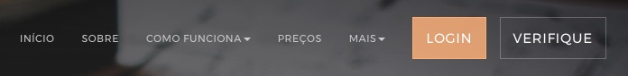
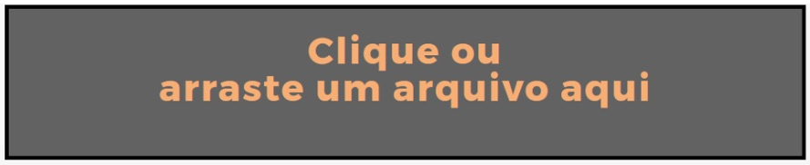
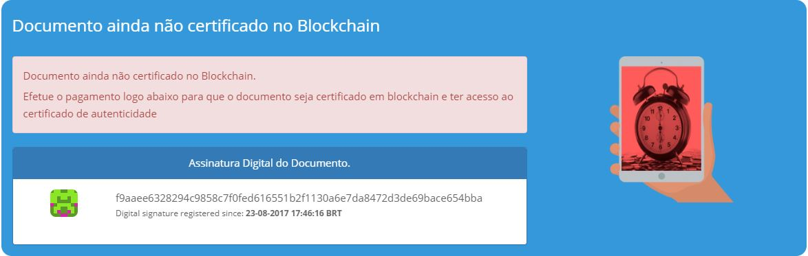
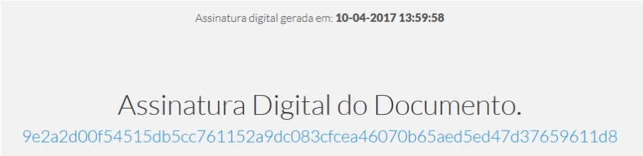
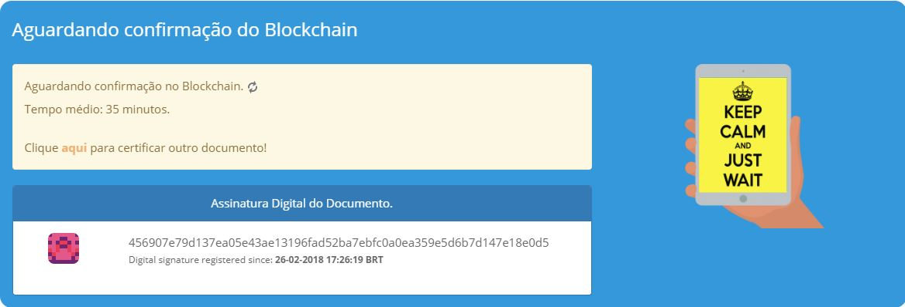
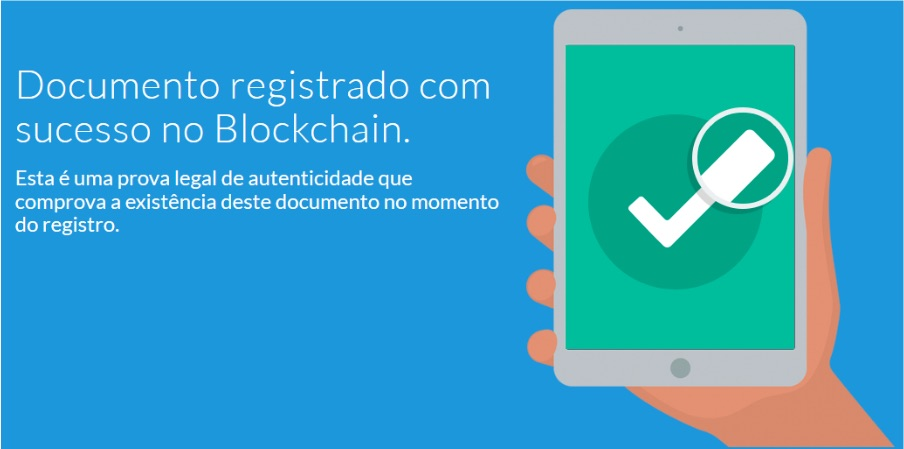
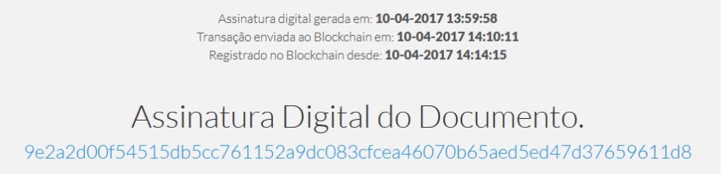

BitRegistro - Registro de Autenticidade
=======================================

=================
Registro Unitário
=================

Este documento foi elaborado para guiar o usuário passo a passo para registrar um documento digital utilizando a plataforma da OriginalMy.

É possível registrar qualquer arquivo digital na plataforma da OriginalMy, seja ele um arquivo de texto, imagem ou som.

O arquivo que será registrado, não poderá sofrer alterações posteriores, sendo assim, crie cópias de segurança do arquivo e guarde em locais seguros. Mesmo um salvamento automático do arquivo é considerado como alteração.

**Para sua segurança e privacidade, o documento não é armazenado pela OriginalMy**

Criando o BitRegistro
---------------------

- Acesse o site: originalmy.com e clique em Login
  

  

- Clique para selecionar o arquivo a ser registrado ou arraste o arquivo para dentro do campo indicado

- Assim que o arquivo é submetido à plataforma, é gerada a assinatura digital do documento e ele está pronto para ser enviado para registro no Blockchain após o pagamento

- Pague o registro do documento. O pagamento pode ser por Bitcoin ou via PagSeguro. Assim que o pagamento for confirmado, o documento será enviado para registro no Blockchain

- Assim que o documento for registrado em Blockchain, será fornecido um certificado e o carimbo de tempo do documento

Verificando o BitRegistro
-------------------------

A consulta de qualquer documento na plataforma pode ser realizada de forma gratuita, quantas vezes desejar e em qualquer momento.

Para efetuar a consulta, é necessário ter a posse do documento que foi registrado.

- Acesse o site: originalmy.com e clique em Login
  

  

- Clique para selecionar o arquivo previamente registrado ou arraste o arquivo para dentro do campo indicado

Assim que o arquivo é submetido à plataforma, a assinatura digital é recalculada e caso o documento no tenha sofrido nenhuma alteração, é apresentado o status atual do documento: documento não certificado, aguardando confirmação ou documento registrado.

Submetendo o documento à plataforma, todas as informações relativas ao registro aparecerão na tela.

