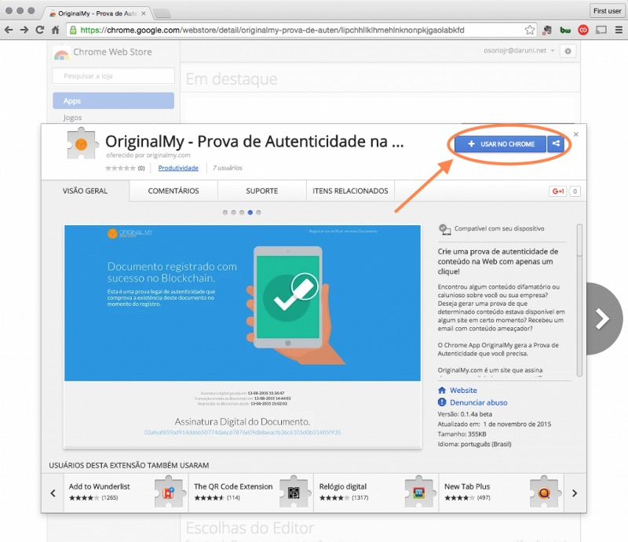
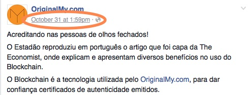
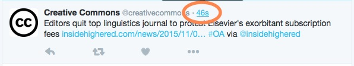
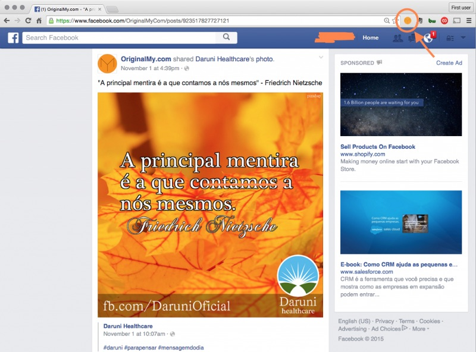
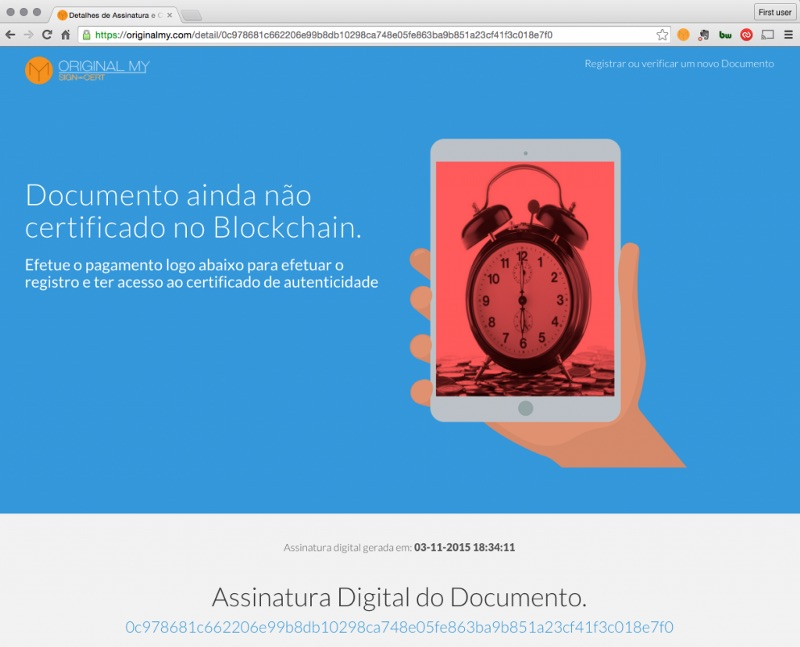

Prova de Autenticidade para Conteúdo Web
========================================

========
O que é?
========

Encontrou algum conteúdo calunioso sobre você ou sua empresa? Deseja gerar uma prova de que determinado conteúdo estava disponível em algum site em certo momento? Recebeu um email com conteúdo ameaçador?

A Extensão para o browser Chrome OriginalMy gera a Prova de Autenticidade que você precisa.

.. warning:: Esta ferramenta cria uma prova adicional e complementar que poderá ser utilizada em conjunto com outras provas que ajudem a montar um perfil de comportamento que será analisado pela justiça.

Este aplicativo para o browser Chrome faz uma cópia do conteúdo que está sendo visualizado no browser e te fornece um relatório completo comprovando quando e onde esta informação estava disponível. Além disso ele já registra uma assinatura digital única e exclusiva que identificará esse documento em OriginalMy.com para fornecer uma prova de autenticidade com carimbo de tempo, confirmando o momento em que o conteúdo estava disponível.

Também chamado de **BitRegistro**, essa prova legal de autenticidade protege criações, ideias, contratos e quaisquer documentos digitais que necessitem de comprovação de integridade e autenticidade. Este BitRegistro é um registro exclusivo que identifica e comprova a autenticidade e integridade do documento registrado utilizando uma rede descentralizada e distribuída, livre de fraudes, confiável e que não pode ser alterada por governos ou instituições — o Blockchain das redes Bitcoin, Ethereum, Ethereum Classic e Decred.

Seus principais usos tem sido garantir validade a contratos digitais e documentos com propriedade intelectual, mas também pode ajudar a comprovar a precedência e uso de marcas e muitas outras coisas.

================
Instalação e Uso
================

Instale a extensão utilizando a webstore do Chrome ou clique neste link: https://chrome.google.com/webstore/detail/originalmy-prova-de-auten/lipchhllklhmehlnknonpkjgaolabkfd

Instalação da Extensão OriginalMy no Chrome
-------------------------------------------

.. note:: O plugin só pode ser instalado em navegadores Chrome.

Após a instalação recomenda-se recarregar o browser ou as ‘tabs’ onde se encontram os sites.

.. note:: Sempre utilize links permanentes (permalinks) para a página que deseja registrar.

Procure não solicitar a gravação do feed inteiro do Facebook ou do Twitter. Como a ferramenta percorrerá a página e o feed dessas redes sociais tende ao infinito, provavelmente seu computador não terá memória suficiente para carregar a página inteira e convertê-la para PDF.

Se você deseja gerar uma prova de existência e autenticidade sobre um conteúdo encontrado na Internet, é muito importante que você especifique exatamente qual o conteúdo que deseja registrar, seja um artigo em um blog, no Facebook ou no Twitter por exemplo.

Para acessar diretamente o link permanente do post que deseja registrar, redes sociais como Facebook e Twitter (e muitos outros) disponibilizam os chamados links permanentes (ou permalinks). Veja abaixo formas de encontrar os links permanentes:

**Para acessar o permalink de um post no Facebook**

Clique na data da postagem que o Facebook abrirá o post em uma página exclusiva, exibindo todos os comentários relativos à ela.

**Para acessar o permalink de um comentário no Facebook**

Clique na data do comentário que o Facebook abrirá a postagem com o comentário no topo. É muito útil quando a postagem possui mais de 50 comentários e você deseja registrar a postagem com um comentário específico.
Para acessar o permalink de uma postagem no Twitter:

**Permalink no Twitter**

Botão OriginalMy na Barra de Extensões do Chrome
------------------------------------------------

Após abrir exatamente a página com o conteúdo que deseja registrar, basta clicar no ícone do aplicativo que ele começará a varredura pelo site sendo visualizado no momento.
  

**Solicitação de Registro em OriginalMy.com**

Após a varredura, ele solicitará o registro em OriginalMy.com (que só será efetivamente registrado após confirmação do pagamento) e disponibilizará um relatório em formato PDF para ser usado como prova de autenticidade.

.. note:: Este documento será a própria chave de acesso em OriginalMy.com para futuramente consultar o status de certificação e acessar o certificado de autenticidade emitido após a confirmação de registro.

Dica
----

Sempre redimensione o browser para ajustar seu tamanho ao conteúdo que deseja registrar. O arquivo final ficará menor e utilizará menos memória do seu computador.

.. note:: Tanto este aplicativo quanto o site OriginalMy.com respeitam a sua privacidade.

.. note:: Não tomamos conhecimento ou armazenamos informações referentes ao conteúdo do seu documento, somente da assinatura digital única e exclusiva que é calculada diretamente no seu browser.
  Portanto é responsabilidade do usuário salvar os documentos originais e outros arquivos em locais seguros para garantir a integridade, fazer backups dos mesmos e distribuí-los somente entre as partes interessadas.
  
.. note:: Este aplicativo para o browser Chrome gera uma cópia do conteúdo que está sendo visualizado no browser e fornece um relatório completo comprovando quando e onde esta informação estava disponível. Além disso ele já registra uma assinatura digital única e exclusiva que identificará este documento em OriginalMy.com para fornecer uma prova de autenticidade com carimbo de tempo, confirmando o momento em que o conteúdo estava disponível.

Você pode encontrar este conteúdo no nosso blog `neste link`_ 

.. _neste link: https://medium.com/@originalmy/originalmy-extensão-do-chrome-prova-de-autenticidade-na-web-como-usar-301793ac509
