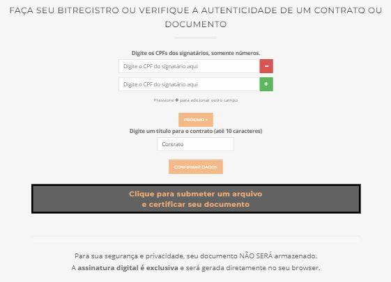
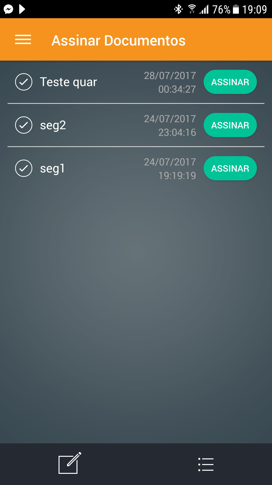
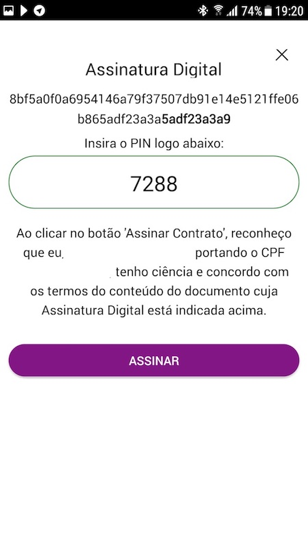
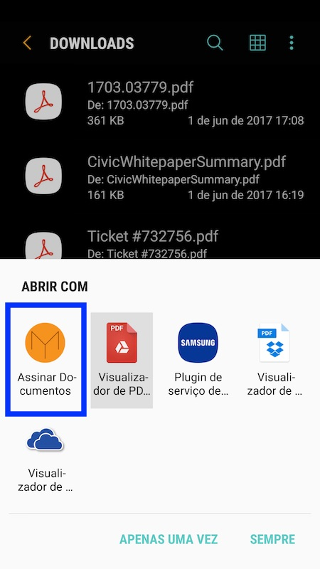
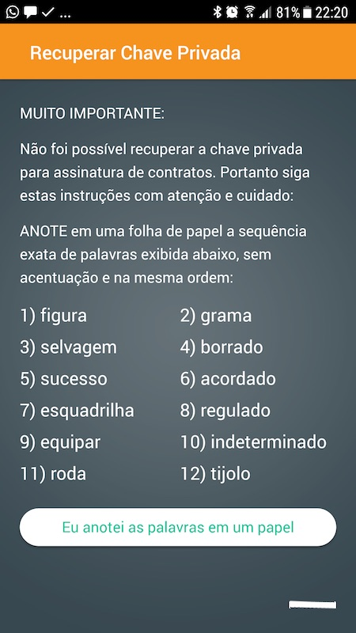

Contratos - Registro e Assinatura
=========

Leia as recomendações para **reforçar a validade jurídica** do seu contrato neste link: http://originalmy.readthedocs.io/pt_BR/latest/6-recomendacoes.html#recomendacoes

=====================
Registro de Contratos
=====================

1. Entre em https://originalmy.com/contratos
2. Preencha os CPFs dos signatários
3. Coloque um apelido para o contrato (esse apelido irá aparecer no app)
4. Submeta o documento final do contrato (PDF)

.. note:: O documento somente será registrado no Blockchain após todos os signatários tiverem o app instalado e efetuado o cadastro completo e validado.

=======================
Assinatura de contratos
=======================

1. Baixe o app Assinar Documento para Android ou Ios.
2. Efetue o cadastro completo
3. Entre no Menu -> Assinar Documentos
4. Clique em Assinar no documento que deseja assinar
5. Coloque o PIN do documento
6. Confirme a assinatura

Como encontrar o PIN do documento
---------------------------------

Existem duas formas de conseguir o PIN do documento. 

.. note:: O PIN é necessário para a PROVA DE POSSE do documento.

* Forma 1:
  Entre em OriginalMy.com, submeta o documento e veja o PIN do contrato
.. image:: images/pin1.jpg

* Forma 2:
  No app, abra o documento PDF selecionando o aplicativo Assinar Documentos para abrí-lo. 
  Dessa forma o App comprovará que o documento é original e está pronto para ser assinado pelo usuário. 

    
Controles de Segurança para a Assinatura de Contratos
-----------------------------------------------------

O OriginalMy possui 4 níveis de segurança para a assinatura de contratos:

1) Cadastro completo através do app (KYC completo com validação do CPF em bases públicas)
2) Usuário e senha
3) Chave privada em posse do usuário (através da um conjunto com 12 palavras em português)
4) Prova de Posse do documento

Exemplo de conjunto de palavas. **Anote-as em um papel**. O sistema solicitará as palavras para ter certeza de que o usuário a armazenou.

.. note:: o OriginalMy **nunca** entrará em contato para solicitar as 12 palavras fornecidas no cadastro
  Lembre-se que essas 12 palavras restauram a sua Identidade Blockchain.
  Anote-as em um papel e guarde-as em local seguro.
  
.. note:: Para assinar documentos através do browser, será necessário entrar com as 12 palavras fornecidas no cadastro.
  Depois disso o sistema fornecerá uma opção para baixar um arquivo que facilitará o processo nas próximas vezes. Armazene este arquivo em um local seguro.

.. warning:: **NUNCA** entregue as 12 palavras ou o arquivo baixado para qualquer pessoa. Eles representam a sua identidade blockchain.

