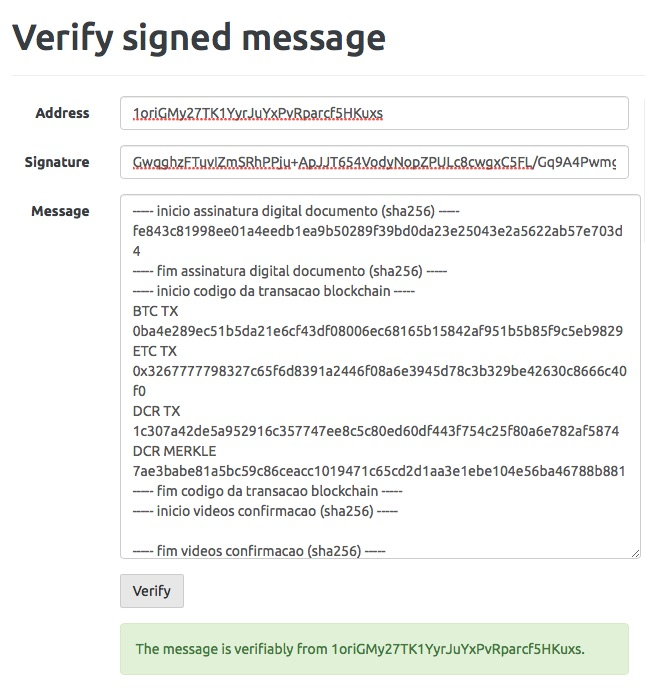

Certificado de Autenticidade
============================

=======
O que é
=======

O certificado de autenticidade utiliza criptografia para comprovar que o conteúdo de algo não foi alterado.

Tecnicamente, utilizamos o algorítmo ECDSA-256 para gerar o certificado, utilizando a identidade blockchain do OriginalMy
representada pela chave pública **1oriGMy27TK1YyrJuYxPvRparcf5HKuxs**

======================
Exemplo de certificado
======================

.. image:: images/certificado.jpg
  :scale: 50%
  
============================
Como verificar o certificado
============================

1. Entre no site https://insight.bitpay.com/messages/verify
2. Preencha as informações de acordo com a imagem abaixo
3. Clique no botão *Verify*

.. note: Faça download do certificado e armazene-o junto ao documento original, que foi autenticado no OriginalMy.com

Informações do certificado

* Chave Pública (*address*)
  Identidade Blockchain do OriginalMy, utilizada para assinar o certificado digital de autenticidade
  
* Assinatura ECDSA-256 bits (*signature*)
  Esta é a assinatura digital gerada através da identidade blockchain do OriginalMy. Essa assinatura é essencial pois ela 
  comprova que o conteúdo não sofreu alteração.
  
* Conteúdo do certificado digital (*message*)

   É composta de 3 partes:
   
   1) Assinatura digital do documento autenticado
   
   2) Endereços (*código da transação*) onde você encontra o registro da assinatura digital nos blockchains 
    Obs: No blockchain Decred você encontrará o *DCR MERKLE* ao invés da assinatura digital
    
   3) Assinaturas digitais dos vídeos de confirmação (caso existam)
   
