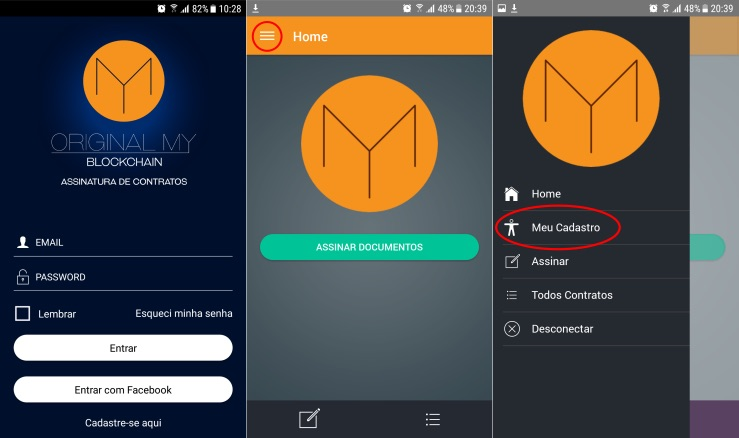

Recomendações 
=============

=========
Contratos
=========

Este manual foi elaborado com o intuito de orientar os usuários que pretendem utilizar o aplicativo fornecido pela OriginalMy para formalização de contratos.

.. warning:: O conteúdo é meramente informativo e não dispensa a consulta a um advogado.

Recomendamos apenas duas alterações em seu contrato tradicional: 

1. Inserção da identidade blockchain e 
2. Inclusão de uma cláusula no final do contrato reforçando a conformidade com a lei MP2200-2/2001. 

Para ser possível inserir todas as informações recomendadas, é essencial que todos os signatários tenham tomado as seguintes ações:

- Instalado no smartphone o aplicativo **OriginalMy Blockchain** fornecido pela OriginalMy (disponível para os sistemas Android e iOS);

- Validado o cadastro fornecendo todas as informações requisitadas.

Após instalação e validação do cadastro de todos os signatários, recomendamos a inclusão das informações abaixo em todos os contratos que utilizam o modelo de assinatura eletrônica fornecido pela OriginalMy através do aplicativo OriginalMy Blockchain:

Identidade Blockchain na qualificação das partes
------------------------------------------------

Na qualificação das partes (identificação dos signatários), incluir também a informação sobre sua identificação no blockchain conforme exemplo abaixo:

.. note:: Nome completo, nacionalidade, estado civil, profissão, inscrito no RG sob nº 00.000.000-0 e no CPF sob nº 000.000.000-00, residente à Av. Xxxxx, nº 00, Bairro, Cidade, Estado, CEP 00000-000, identidade blockchain xxxx

Para encontrar a identidade blockchain, basta seguir os passos:

- Faça login no aplicativo OriginalMy Blockchain;
- Clique no menu no canto superior esquerdo;
- Clique em **Meu Cadastro**
- Toque na sequência de letras e números na frente do item **Blockchain ID** que a sequência será copiada para a área de transferência;
- Cole a informação copiada no local que preferir (e-mail, Whatsapp, Slack, etc.)

Recomendação de Cláusula de Conformidade
-----------------------------------------

Recomendamos inserir uma cláusula ao final do documento, indicando a MP 2200-2/2001 que valida o modelo de assinatura e dispensa a utilização de um certificado ICP-Brasil. Segue um exemplo:

.. warning:: Este é um exemplo de redação de cláusula genérica e não dispensa a consulta a um advogado. 

.. note:: **Cláusula XX:** As Partes declaram e concordam que o presente instrumento, incluindo todas as páginas de assinatura e eventuais anexos, todas formadas por meio digital com o qual expressamente declaram concordar, representam a integralidade dos termos entre elas acordados, substituindo quaisquer outros acordos anteriores formalizados por qualquer outro meio, verbal ou escrito, físico ou digital, nos termos dos art. 107, 219 e 220 do Código Civil.
 
 Adicionalmente, nos termos do art. 10, § 2º, da Medida Provisória nº 2.200-2, as Partes expressamente concordam em utilizar e reconhecem como válida qualquer forma de comprovação de anuência aos termos ora acordados em formato eletrônico, ainda que não utilizem de certificado digital emitido no padrão  ICP-Brasil, incluindo assinaturas eletrônicas na plataforma OriginalMy (www.originalmy.com). A formalização das avenças na maneira supra acordada será suficiente para a validade e integral vinculação das partes ao presente Contrato.

==========
Documentos
==========

Este documento foi elaborado para auxiliar os usuários a registrarem a autenticidade de seus documentos de forma segura e permanente.

Tipos de arquivos
-----------------

Pode ser feito o BitRegistro de qualquer arquivo digital na plataforma OriginalMy, sendo assim, arquivos de texto, imagens, fotos, desenhos, vídeos, sons, tudo o que for digital poderá ter a sua autenticidade registrada.

Um BitRegistro, por exemplo, pode contemplar um arquivo digital independente do número de páginas ou do tamanho.

Por que utilizar?
-----------------

O BitRegistro, ou registro de autenticidade em blockchain, é recomendado quando há intenção de comprovar:

- autoria: de uma obra, projeto ou criação;

- imutabilidade: de um ato, de um contrato ou acordo;

- data do acontecimento: para que fique gravado o momento da ação que se quer registrar;

- partes vinculadas: quem são as pessoas envolvidas na ação, projeto, acordo, etc.

Quando fazer seu BitRegistro?
-----------------------------

O ideal é que seja certificada a versão final do documento, quando não houver mais nenhuma alteração a ser feita.  

Em caso de qualquer alteração, o documento ficará diferente do certificado anteriormente e será considerado como um novo documento. Por este motivo será necessário um novo BitRegistro para o mesmo.

Sempre que possível, recomendamos que o arquivo seja convertido para  a extensão .pdf (para que não sofra alterações como salvamento automático), além de guardar várias cópias do arquivo em locais seguros, como: Dropbox, Google Drive, OneDrive, além de backups em mídias externas (pen drives, HDs, etc). 

.. note:: Como o OriginalMy não armazena documentos ou o conteúdo dos seus documentos digitais, a guarda e backups dos documentos certificados é de responsabilidade do proprietário do documento. Faça cópias e as distribua para todos os interessados que necessitarem verificar a autenticidade.

.. note:: **Pode:** O arquivo pode ser copiado e/ou enviado para outras pessoas. O nome do documento pode ser alterado após o registro.

 **Não pode:** Abrir e editar o documento após o registro. Não pode abrir o documento original em ferramentas que possuem salvamento automático sob o risco de ser alterado.
 
Para conteúdo que contenha propriedade intelectual, é muito importante que o registro de autenticidade em Blockchain seja feito antes da publicação, garantindo assim, que a primeira certificação do conteúdo seja a do próprio autor. Em caso de disputa, poderá comprovar a precedência do seu material.
 
O que certificar?
-----------------

Há inúmeros casos de utilização do registro de autenticidade em Blockchain, vamos citar apenas alguns casos, que não se limitam às aplicações apresentadas.

- Projetos acadêmicos: pesquisas científicas, trabalhos de conclusão de curso, monografias, dissertações de mestrado, teses de doutorado, material didático, metodologias de ensino;
- Design: peças publicitárias, projetos, criações, propostas;
- Artistas: letras, partituras, melodias, livros, fotos, certificados de autenticidade, roteiros;
- Empreendedores: logos, marcas, projetos, invenções, ideias de negócio, produtos;
- Empresas: contratos, acordos, propostas, termos de concordância, processo produtivo, cadeia produtiva, certificação de produtos, certificados de cursos, votações, atas, deliberações, prestação de contas, inventários, apólices, etc.
 
.. warning:: O BitRegistro na OriginalMy não substitui o registro em instituições governamentais, quando previsto em lei.

Como funciona?
--------------

Quando o documento é submetido à plataforma da OriginalMy, é calculada uma identidade única e exclusiva para aquele documento. Essa identidade única é chamada de Assinatura Digital ou Hash.

Quando o hash do documento é certificado no Blockchain, ele é copiado em todos os computadores do mundo que estão ligados à rede a qual o blockchain pertence, dessa forma, a certificação é multiplicada milhares de vezes, garantindo assim que ela nunca será apagado da rede.

É seguro?
---------

Sim e de muitas formas diferentes:

- Perenidade: Uma vez registrado, sempre será possível fazer a consulta do documento no blockchain, independente da existência da OriginalMy;
- Imutabilidade: Qualquer alteração, por menor que seja, altera a identidade do documento e isso torna muito fácil a detecção de fraudes e alterações em contratos por exemplo;
- Confidencialidade: em nenhum momento a OriginalMy tem acesso ao conteúdo do documento submetido à plataforma;
- Legalidade: Toda a plataforma foi construída com embasamento legal para que os documentos registrados tenham força de prova. 

==========================
Recomendações de Segurança
==========================

1) Faça backups
 Faça backups do documento original em diversos lugares. Compartilhe esses arquivos com todos os interessados

.. note:: Você *pode* alterar o nome do documento. Você *não pode* abrir, alterar e/ou salvar o documento pois será considerado um documento diferente do registrado anteriormente

2) Guarde o código da transação
 O código da transação é o endereço onde você encontra o seu BitRegistro em cada um dos blockchains 
 
3) Guarde a Assinatura Digital do seu documento

4) Faça download do seu certificado digital e armazene-o na mesma pasta do documento

.. warning:: O salvamento automático dos programas pode alterar internamente o documento, portanto utilize uma cópia caso queira visualizar seu conteúdo. Em caso de alteração no documento é necessário um novo registro. Este registro é válido apenas para o original, sem alterações. Qualquer alteração no original invalida a identificação da assinatura digital, pois o mesmo deixa de ser o documento registrado

